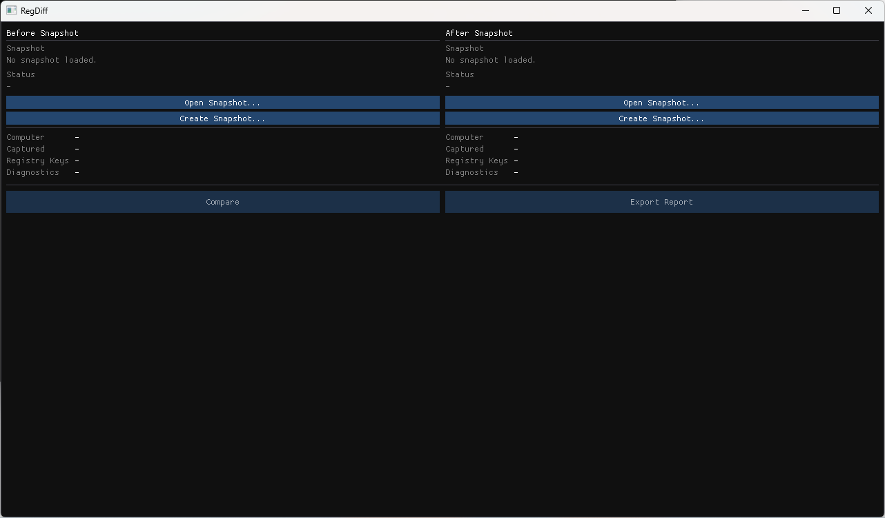

# RegDiff

RegDiff is a small Windows utility for capturing Registry snapshots and comparing them later.

It can be used either through a graphical interface or from the command line, making it useful for both interactive investigations and automation.

RegDiff is **read-only**. It uses the Windows Registry API to enumerate and read Registry Keys and Values, and **never modifies the Registry**.

I originally put this together in about a day to troubleshoot Registry changes between software installations. Rather than letting it sit on my hard drive, I thought it might be useful to others.

> This is an early project. It does one thing, and it aims to do it simply. Contributions and ideas are welcome.



## Features

- Read-only Registry access
- Capture Registry snapshots
- Compare two Registry snapshots
- View added, removed and modified Registry Keys and Values
- Export a human-readable comparison report
- Graphical and command-line interfaces

## Building

### Requirements

- Windows
- CMake
- Visual Studio 2022 (or another C++20 compiler)

This repository includes a vendored copy of **vcpkg**, so a separate installation is not required.

Bootstrap `vcpkg`:

```bash
vendor\vcpkg\bootstrap-vcpkg.bat
```

Configure the project using the provided CMake preset:

```bash
cmake --preset base
```

Build the Release configuration:

```bash
cmake --build --preset release
```

## Usage

### Graphical Interface

Launching `RegDiff.exe` without any command-line arguments starts the graphical interface.

1. Create or open a **Before** snapshot.
2. Create or open an **After** snapshot.
3. Click **Compare**.
4. Browse the differences.
5. Export a report if required.

### Command Line

Capture the standard Windows Registry hives:

```bash
RegDiff snapshot --all --output snapshot.json
```

Capture one or more Registry roots:

```bash
RegDiff snapshot --root HKLM --root HKCU --output snapshot.json
```

Compare two snapshots:

```bash
RegDiff compare before.json after.json
```

Run `RegDiff --help` for the full command-line reference.

## Continuous Integration

A GitHub Actions workflow is included to build RegDiff using the same CMake presets used for local development.

## Status

RegDiff is intentionally small and focused. There are plenty of areas that could be improved, for example:

- Search and filtering
- Background snapshot capture
- Additional export formats
- General UI improvements

Contributions, bug reports and suggestions are always welcome.

## License

MIT